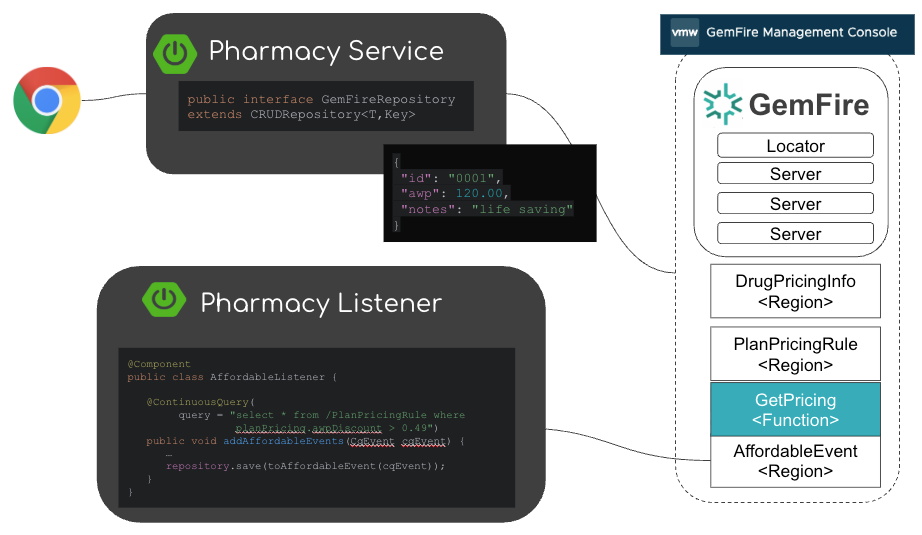

# Life Science GemFire Showcase

This project provides a showcase of of [GemFire](gemfire.dev) for life sciences, use cases.

| Implementation                                                            | Notes                                                               |
|---------------------------------------------------------------------------|---------------------------------------------------------------------|
| [pharmacy-service](applications/pharmacy-service)                         | Spring Boot Service with a REST end point for basic CRUD operations |
| [pharmacy-listener](applications/pharmacy-listener)                       | Spring Boot GemFire Continuous Query example                        |
 | [adjudication-pricing-function](components/adjudication-pricing-function) | GemFire function example accessing co-located data                  |

Scripts
- [Start Up](deployment/local/gemfire/start-multi-servers.sh)

See [Instructions for demos](docs/demo/README.md)

---

# Building Source Code

Set up Maven Repository user credentials See https://gemfire.dev/quickstart/java/

---

# GemFire Resources 

- GemFire showcase [https://github.com/ggreen/gemfire-showcase](https://github.com/ggreen/gemfire-showcase).
- Spring + GemFire showcase [https://github.com/ggreen/spring-gemfire-showcase](https://github.com/ggreen/spring-gemfire-showcase) 

